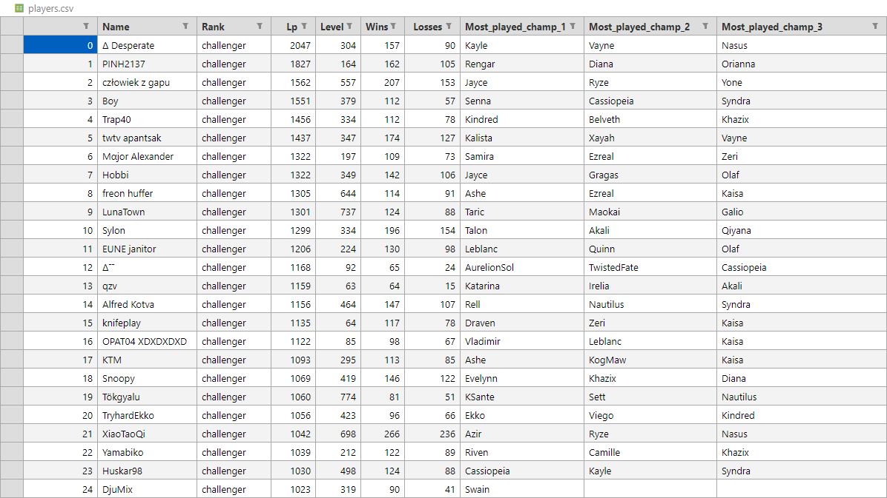
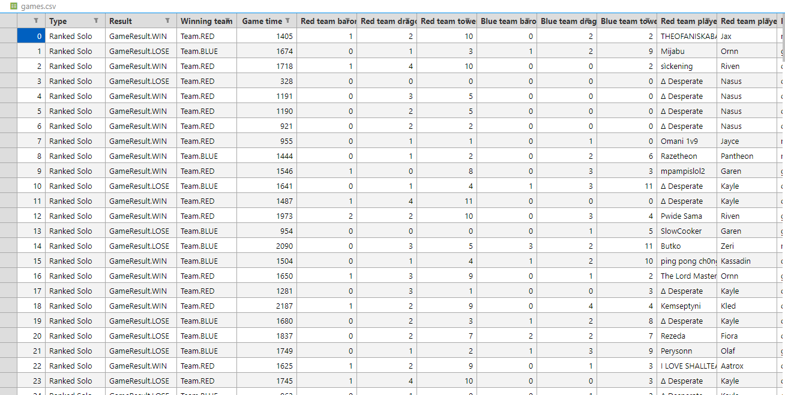
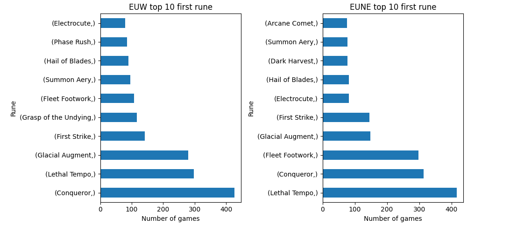
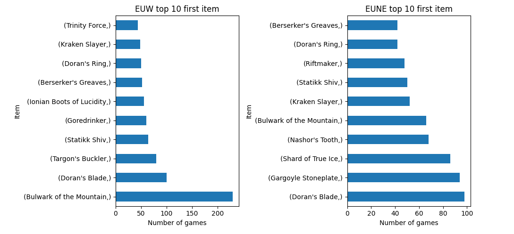
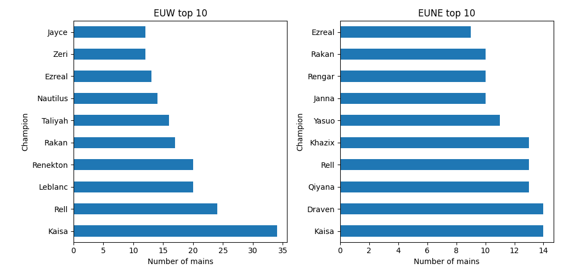
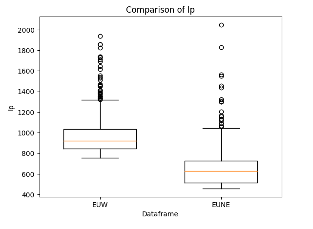

# OP.GG scrapper

## About
- this script provides functionaliteis for scrapping info from [OP.GG](https://op.gg) and saves to csv for further analysis


## Usages
### 1- Scrapping leaderboard
```python
 # get top 500 players in euw and save
players =  opgg_scrapper.get_top_N_players(500,driver , region='euw')
```
#### Can be saved to csv using
```python
 # get top 500 players in euw and save
opgg_scrapper.create_dataframe_from_players(players).to_csv('players_euw.csv')
```
#### Sample

### 2- Scrapping games for specific player
```python
 # get top 500 players in euw and save
games = opgg_scrapper.get_player_N_games( player_name= "Δ Desperate" ,region='eune', driver_insance=driver , N=200 , force_update= False, force_ranked_only=True) 
```

#### Can be saved to csv using
```python
 # get top 500 players in euw and save
opgg_scrapper.create_dataframe_from_game_records(games).to_csv('games_first_euw.csv')

```
#### Sample


### You can provide your custom driver instance or insantiate one using 
```python
driver = opgg_scrapper.get_chrome( headless=True , adblock_extenstion_path='extension_2023_9_10_1131.crx') 
```


### Example of analysis
#### Top runes comparison in servers


#### Top first items


#### Top champions


#### LP distribution



## License
This project is licensed under the MIT License - see the [LICENSE](LICENSE) file for details

